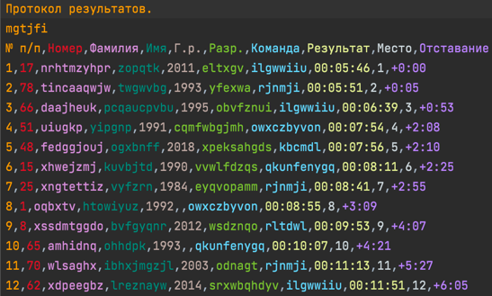

# Система для проведения спортивных соревнований

## Предназначение:

Данная программа помогает организаторам спортивных соревнований.
Оно может: 
 * Собирать данные о мероприятии воедино.
 * Быстро обрабатывать их, формируя стартовый протокол и сохраняя его в отдельный файл.
 * Проводить жеребьёвку.
 * Сохранять все полученные от пользователя данные и не переспрашивать их при повторном запуске.
 * По показателям контрольных пунктов определять результаты соревнований.
 * Выявлять нарушителей и людей, сошедших с дистанции.
 * Сохранять результаты группового зачёта. 
 * Сохранять результаты зачёта коллективов.
 * Создавать произвольное соревнование и автоматически генерировать для него случайные (но корректные) данные.

## Использование:

* Пользоваться программой очень просто - сначала нужно вести данные про группы, коллективы, мероприятие и дистанции. 

* Можно выбирать готовые файлы: 

* Или ввести их самому: 

* После того как все данные введены нужно нажать draw. После этого программа выдаст стартовый протокол.

* Все протоколы выдаваемые программой можно сохранить: 

* После выдачи стартового протокола программа попросит вести протокол прохождения пунктов. Она поддерживает два типа: 

* Пример финишного протокола: 

* Пример финишного протокола для коллективов: 

Программа поддерживает консольный режим: 

 * Ответив на первый вопрос "да" мы сгенерировали случные данные для соревнований, которые потом и передали программе.
 * После ввода данных в папке start-protocol сформировались стартовые протоколы для всех заявленных групп. Вот пример одного из них: 

 * После этого мы выбрали формат файла с дистанциями. 
 * Дальше указали пути до файлов, куда сохранили результаты, вот пример файла с результатами групп: 

